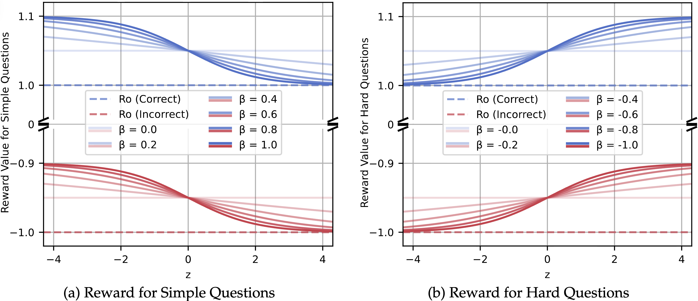
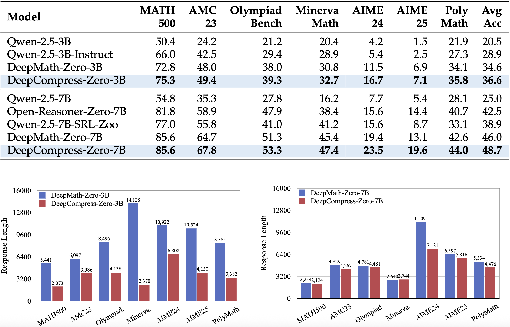

<div align="center">

# 💎 _DeepCompress_

<div>
 A Dual Reward Strategy for Dynamically Exploring and Compressing Reasoning Chains
</div>
</div>

<div>
<br>

<div align="center">

[](https://github.com/Skytliang/DeepCompress)
[](https://arxiv.org/abs/2510.27419)
</div>
</div>

## 🔥 News
- **January 26, 2026**: DeepCompress is accepted to **ICLR 2026**.

## 📦 Resource

- 🤗 Training data: [`DeepMath-103K`](https://huggingface.co/datasets/zwhe99/DeepMath-103K)
- 💻 Code: [`DeepCompress`](https://github.com/Skytliang/DeepCompress)
- 📝 Paper: [`arXiv:2510.27419`](https://arxiv.org/abs/2510.27419)

## 📖 Overview

**DeepCompress** is a novel reinforcement learning framework designed to solve the efficiency-accuracy trade-off in Large Reasoning Models (LRMs). By dynamically adapting reasoning length, it achieves superior performance with significantly lower computational costs. Key features include:

1. Dual Reward Strategy: Unlike existing methods that indiscriminately penalize long responses, DeepCompress employs an adaptive length reward. It encourages concise, efficient reasoning for "Simple" problems while promoting deeper, exploratory chains of thought for "Hard" problems.

<div align="center"> 

<sub>The mechanism of adaptively rewarding shorter vs. longer reasoning paths based on difficulty.</sub> </div>

2. Model-Aware Difficulty: DeepCompress eliminates the need for static external difficulty labels. It utilizes a real-time, dynamic mechanism to classify problems based on the model's evolving capabilities during training, ensuring the reasoning budget is allocated exactly where it is needed most.

3. Simultaneous Efficiency & Accuracy: DeepCompress consistently outperforms baseline methods (such as DeepMath-Zero) on challenging benchmarks like AIME 2025 and MATH-500. Crucially, it achieves these gains while reducing token usage by up to 57.9%, effectively compressing reasoning without sacrificing depth.

<div align="center"> 

<sub>Comparison of Pass@1 Accuracy vs. Average Token Length across benchmarks.</sub> </div>

4. Smarter Exploration: Analysis reveals that DeepCompress fosters high policy entropy and frequent self-reflection ("aha moments"). It transforms the model to think smarter, not just longer, by autonomously compressing mastered reasoning steps and extending under-learned ones.


## 🎯Quick Start

#### Environment Preparation

```shell
git clone --recurse-submodules https://github.com/Skytliang/DeepCompress.git && cd DeepCompress

conda create -y -n deepcompress python=3.12.2 && conda activate deepcompress
pip3 install ray[default]
pip3 install torch==2.5.1 torchvision==0.20.1 torchaudio==2.5.1 --index-url https://download.pytorch.org/whl/cu124
pip3 install flash-attn==2.7.4.post1 --no-build-isolation
pip3 install omegaconf==2.4.0.dev3 hydra-core==1.4.0.dev1 antlr4-python3-runtime==4.11.0 vllm==0.7.3
pip3 install math-verify[antlr4_11_0]==0.7.0 fire deepspeed tensorboardX prettytable datasets transformers==4.49.0
pip3 install -e verl
pip3 install langdetect==1.0.9 pebble==5.1.0 word2number
```

#### Evaluation

* Example eval script for DeepMath-Zero-7B:

  ```shell
  VLLM_ALLOW_LONG_MAX_MODEL_LEN=1 VLLM_ATTENTION_BACKEND=XFORMERS VLLM_USE_V1=1 VLLM_WORKER_MULTIPROC_METHOD=spawn python3 uni_eval.py \
      --base_model zwhe99/DeepMath-Zero-7B \
      --chat_template_name default \
      --system_prompt_name simplerl \
      --output_dir  \
      --bf16 True \
      --tensor_parallel_size 8 \
      --data_id zwhe99/MATH \
      --split math500 \
      --max_model_len 32768 \
      --temperature 0.6 \
      --top_p 0.95 \
      --n 16
  ```

* Adjust `--data_id` and `--split` for different datasets:

  | Dataset       | `--data_id`                   | `--split` |
  | ------------- | ----------------------------- | --------- |
  | MATH500       | zwhe99/MATH                   | math500   |
  | AMC23         | zwhe99/amc23                  | test      |
  | OlympiadBench | zwhe99/simplerl-OlympiadBench | test      |
  | MinervaMath   | zwhe99/simplerl-minerva-math  | test      |
  | AIME24        | zwhe99/aime90                 | 2024      |
  | AIME25        | math-ai/aime25                | test      |
  | PolyMath      | zwhe99/pm-en                  | test      |


#### Training

* Data Preparation

  ```shell
  DATA_DIR=/path/to/your/data
  python3 verl/examples/data_preprocess/deepmath_103k.py --local_dir $DATA_DIR
  ```

* Start Ray

  ```shell
  # Head node (×1)
  ray start  --head --port=6379  --node-ip-address=$HEAD_ADDR --num-gpus=8
  
  # Worker nodes (×7 or ×11)
  ray start  --address=$HEAD_ADDR:6379 --node-ip-address=$WORKER_ADDR --num-gpus=8
  ```

* Launch training at head node. See `scripts/train` for training scripts.


## 🙏 Acknowledgements

This work can not be done without the help of the following works:

- **[verl](https://github.com/volcengine/verl)**: A very fast reinforcement learning framework.
- **[DeepMath](https://github.com/zwhe99/DeepMath)**: Their high-quality dataset and series of models served as a strong baseline for our work.


## 📚 Citation
```bibtex
@article{liang2025deepcompress,
      title={DeepCompress: A Dual Reward Strategy for Dynamically Exploring and Compressing Reasoning Chains}, 
      author={Tian Liang and Wenxiang Jiao and Zhiwei He and Jiahao Xu and Haitao Mi and Dong Yu},
      year={2025},
      eprint={2510.27419},
      archivePrefix={arXiv},
      primaryClass={cs.AI},
      url={https://arxiv.org/abs/2510.27419}, 
}
```
